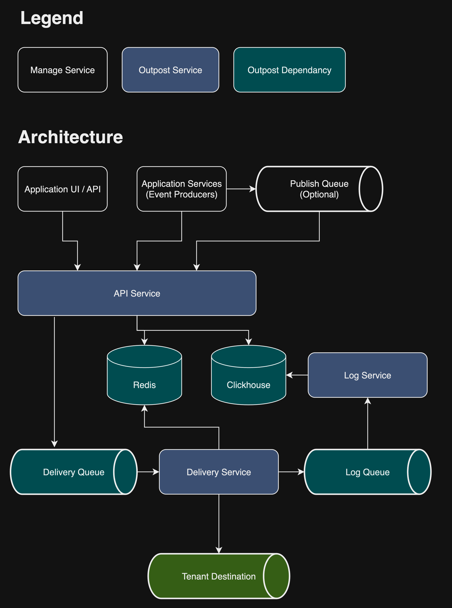
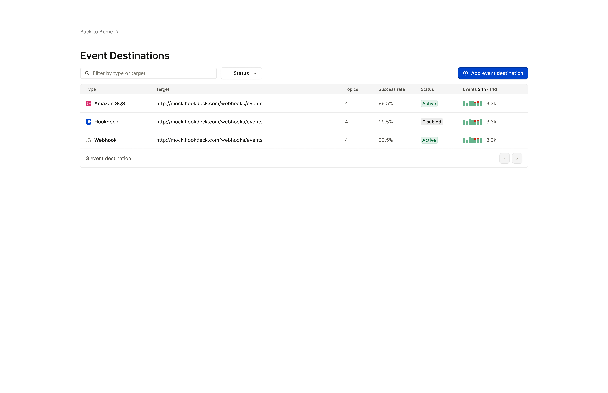

<br>

<div align="center">
  <picture>
    <source media="(prefers-color-scheme: dark)" srcset="images/outpost-logo-white.svg">
    
  </picture>
</div>

<br>

<div align="center">

[](#license)
[](https://goreportcard.com/report/github.com/hookdeck/outpost)
[](https://github.com/hookdeck/outpost/issues)


</div>

<div align="center">
  <h1>Open Source Outbound Webhooks and Event Destinations Infrastructure</h1>
</div>

<div align="center">

[Documentation](#documentation)
·
[Report a bug](issues/new?assignees=&labels=bug&projects=&template=bug_report.md&title=%F0%9F%90%9B+Bug+Report%3A+)
·
[Request a feature](issues/new?assignees=&labels=enhancement&projects=&template=feature_request.md&title=%F0%9F%9A%80+Feature%3A+)

<!-- ·
[Join our Slack](https://hookdeck.com/slack?ref=github-outpost) -->

</div>

Outpost is a self-hosted and open-source infrastructure that enables event producers to add outbound webhooks and [Event Destinations](https://eventdestinations.org?ref=github-outpost) to their platform with support for destination types such as Webhooks, Hookdeck Event Gateway, Amazon EventBridge, AWS SQS, AWS SNS, GCP Pub/Sub, RabbitMQ, and Kafka.

The Outpost runtime has minimal dependencies (Redis, PostgreSQL or Clickhouse, and one of the supported message queues), is 100% backward compatible with your existing webhooks implementation and is optimized for high-throughput, low-cost operation.

Outpost is built and maintained by [Hookdeck](https://hookdeck.com?ref=github-outpost). It's written in Go and distributed as a binary and Docker container under the Apache-2.0 license.



Read [Outpost Concepts](https://outpost.hookdeck.com/docs/concepts) to learn more about the Outpost architecture and design.

## Features

- **Event topics and topic-based subscriptions**: Supports the common publish and subscription paradigm to ease adoption and integration into existing systems.
- **Publish events via the API or a queue**: Publish events using the Outpost API or configure Outpost to read events from a publish queue.
- **At least once delivery guarantee**: Messages are guaranteed to be delivered at least once and never lost.
- **Event fanout**: A message is sent to a topic is replicated and sent to multiple endpoints. This allows for parallel processing and asynchronous event notifications.
- **Automatic and manual retries**: Configure retry strategies for event destinations and manually trigger event delivery retries via the API or user portal.
- **Multi-tenant support**: Create multiple tenants on a single Outpost deployment.
- **User portal**: Allow customers to view metrics, manage, debug, and observe their event destinations.
- **Delivery failure alerts**: Manage event delivery failure alerts.
- **OpenTelemetry**: OTel standardized traces, metrics, and logs.
- **Event destination types**: Out of the box support for Webhooks, Hookdeck Event Gateway, Amazon EventBridge, AWS SQS, AWS SNS. GCP Pub/Sub, RabbitMQ, and Kafka.
- **Webhook best practices**: Opt-out webhook best practices, such as headers for idempotency, timestamp and signature, and signature rotation.
- **SDKs and MCP server**: Go, Python, and TypeScript SDK are available. Outpost also ships with an MCP server. All generated by [Speakeasy](https://speakeasy.com).

See the [Outpost Features](https://outpost.hookdeck.com/docs/features) for more information.

## Documentation

- [Overview](https://outpost.hookdeck.com/docs/overview)
- [Concepts](https://outpost.hookdeck.com/docs/concepts)
- [Quickstarts](https://outpost.hookdeck.com/docs/quickstarts)
- [Features](https://outpost.hookdeck.com/docs/features)
- [Guides](https://outpost.hookdeck.com/docs/guides)
- [API Reference](https://outpost.hookdeck.com/docs/references/api)
- [Configuration Reference](https://outpost.hookdeck.com/docs/references/configuration)

_The Outpost documentation is built using the [Zudoku documentation framework](https://zuplo.link/outpost)._

## Quickstart

Ensure you have [Docker](https://docs.docker.com/engine/install/) installed.

Clone the Outpost repo:

```sh
git clone https://github.com/hookdeck/outpost.git
```

Navigate to `outpost/examples/docker-compose/`:

```sh
cd outpost/examples/docker-compose/
```

Create a `.env` file from the example:

```sh
cp .env.example .env
```

Update the `$API_KEY` value within the new `.env` file.

Start the Outpost dependencies and services:

```sh
docker-compose -f compose.yml -f compose-rabbitmq.yml -f compose-postgres.yml up
```

Check the services are running:

```sh
curl localhost:3333/api/v1/healthz
```

Wait until you get a `OK%` response.

Create a tenant with the following command, replacing `$TENANT_ID` with a unique identifier such as "your_org_name", and the `$API_KEY` with the value you set in your `.env`:

> [!TIP]  
> You can use shell variables to store the tenant ID and API key for easier use in the following commands:
>
> ```sh
> TENANT_ID=your_org_name
> API_KEY=your_api_key
> URL=your_webhook_url
> ```

```sh
curl --location --request PUT "localhost:3333/api/v1/$TENANT_ID" \
--header "Authorization: Bearer $API_KEY"
```

Run a local server exposed via a localtunnel or use a hosted service such as the [Hookdeck Console](https://console.hookdeck.com?ref=github-outpost) to capture webhook events.

Create a webhook destination where events will be delivered to with the following command. Again, replace `$TENANT_ID` and `$API_KEY`. Also, replace `$URL` with the webhook destinations URL:

```sh
curl --location "localhost:3333/api/v1/$TENANT_ID/destinations" \
--header "Content-Type: application/json" \
--header "Authorization: Bearer $API_KEY" \
--data '{
    "type": "webhook",
    "topics": ["*"],
    "config": {
        "url": "'"$URL"'"
    }
}'
```

Publish an event, remembering to replace `$API_KEY` and `$TENANT_ID`:

```sh
curl --location "localhost:3333/api/v1/publish" \
--header "Content-Type: application/json" \
--header "Authorization: Bearer $API_KEY" \
--data '{
    "tenant_id": "'"$TENANT_ID"'",
    "topic": "user.created",
    "eligible_for_retry": true,
    "metadata": {
        "meta": "data"
    },
    "data": {
        "user_id": "userid"
    }
}'
```

Check the logs on your server or your webhook capture tool for the delivered event.

Get an Outpost portal link for the tenant:

```sh
curl "localhost:3333/api/v1/$TENANT_ID/portal" \
--header "Authorization: Bearer $API_KEY"
```

The response will look something like the following:

```json
{ "redirect_url": "http://localhost:3333?token=$TOKEN" }
```

The `token` value is an API-generated JWT.

Open the `redirect_url` link to view the Outpost portal.



Continue to use the [Outpost API](https://outpost.hookdeck.com/docs/references/api) or the Outpost portal to add and test more destinations.

## Contributing

See [CONTRIBUTING](CONTRIBUTING.md).

## License

This repository contains Outpost, covered under the [Apache License 2.0](LICENSE), except where noted (any Outpost logos or trademarks are not covered under the Apache License, and should be explicitly noted by a LICENSE file.)
