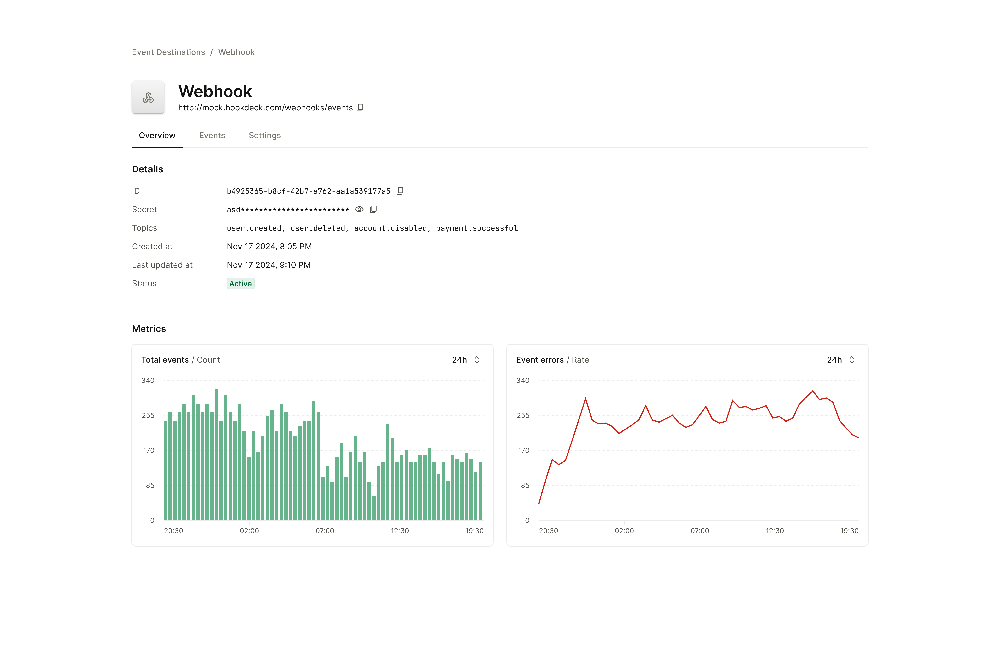

Your application can offer the user the option to configure their destination, view and retry their events using a the Outpost Tenant User Portal. The portal supports:

- Creating and configuring a destination
- Updating or deleting a destination
- Disable or enable a destination
- Display historical events, event data and responses by status and destinations
- Manually retry events

The portal is accessed by generating a JWT from the `GET` `/:tenant_id/portal` endpoint, which returns a redirect URL with a JWT token in the URL. When the user is redirected, the JWT persists in their session storage and is used as the credential for the duration of the session.

When the portal is used, the Outpost API needs to be exposed to the public internet.

The portal is a React SPA that is distributed via the API.

## Required Config

`PORTAL_REFERER_URL` is used to redirect the user when the JWT token is expired or when the user clicks "back".

`ORGANIZATION_NAME` is used to display the name of the organization deploying the portal.

## Theming

The portal supports both light and dark mode which case be set through the `?theme` query param when redirecting to the portal. The portal can also be "forced" into a specific theme using the `PORTAL_FORCE_THEME` configuration option.

Additionally, the portal can be customized with an option logo either with a URL or base64 encoded 64 string using the `PORTAL_LOGO` and `PORTAL_LOGO_DARK` configuration options.

The `PORTAL_ACCENT_COLOR` can also be used to change the primary color.

The Outpost branding can be disabled using the `PORTAL_DISABLE_OUTPOST_BRANDING` configuration option.

## Design

### Home Page

### Destination Overview Page

### Destination Event List

