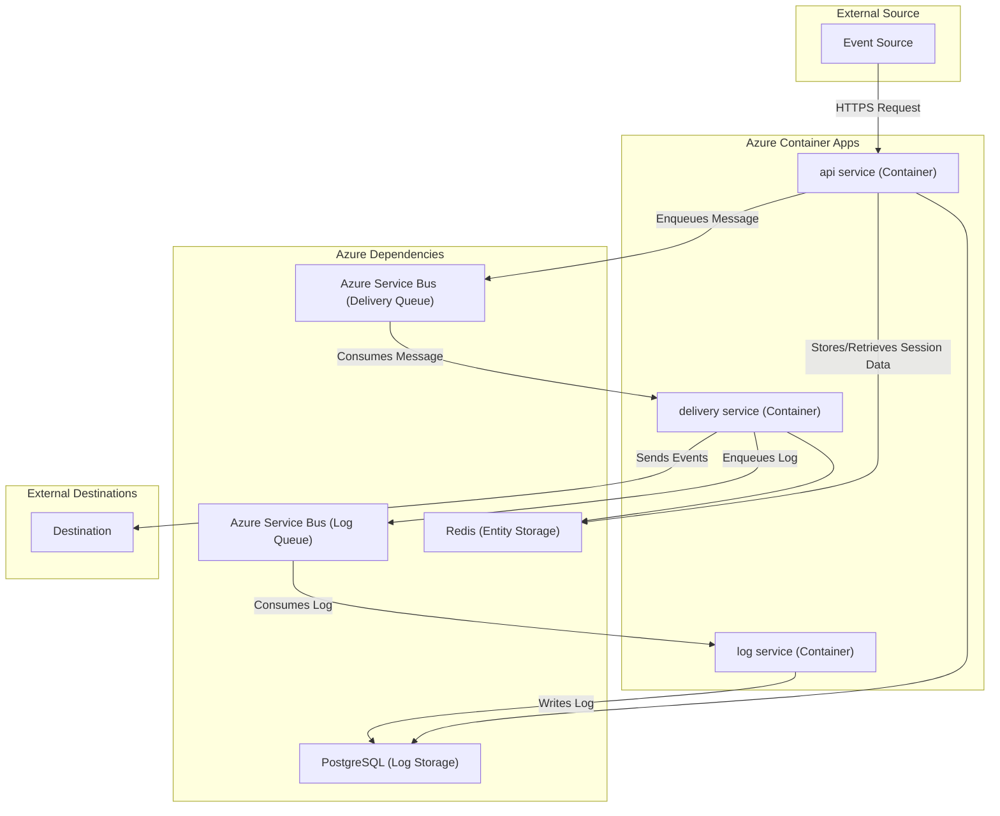

# Deploy Outpost on Azure with Azure Service Bus

This example demonstrates how to deploy Outpost on Azure, using Azure Service Bus as the message queue.

## Prerequisites

Before you begin, ensure you have the following:

*   [Azure CLI](https://docs.microsoft.com/en-us/cli/azure/install-azure-cli) installed.
*   You are logged into your Azure account (`az login`).

## Architecture

This example deploys a distributed architecture on Azure, leveraging managed services for dependencies and Azure Container Apps for the Outpost services.



### Components

#### Dependencies
The deployment relies on Azure-managed services for its core dependencies:
*   **PostgreSQL**: Used for persistent log storage (`log storage`).
*   **Redis**: Used for entity storage and caching (`entity storage`).
*   **Azure Service Bus**: Used as the message queue for both the delivery (`delivery queue`) and log (`log queue`) services.

#### Outpost Services
The Outpost application itself is deployed as three distinct services in Azure Container Apps:
*   **api**: The public-facing API that receives webhooks (`API Service`).
*   **delivery**: A backend service that processes and delivers webhooks from the queue (`Delivery Service`).
*   **log**: A backend service that processes and stores logs (`log service`).

## Scripts

This example includes three main scripts to manage the deployment:

*   `dependencies.sh`: Provisions all the necessary Azure resources, including PostgreSQL for storage, Redis for caching, and Azure Service Bus for the message queue. It also configures the required permissions for the services to interact with each other.
*   `local-deploy.sh`: Deploys the Outpost services using Docker Compose. It uses the Azure resources provisioned by the `dependencies.sh` script.
*   `diagnostics.sh`: Runs checks to validate deployments. Use `--local` for the Docker deployment or `--azure` for the Azure Container Apps deployment. The script requires a webhook URL for testing, which can be provided via the `--webhook-url` flag or the `WEBHOOK_URL` environment variable.
*   `azure-deploy.sh`: Deploys the Outpost services to Azure Container Apps.

## Deployment Steps using Outpost Locally

To deploy Outpost, you must run the scripts in the following order:

1.  **Provision Dependencies:**
    ```bash
    ./dependencies.sh
    ```

2.  **Deploy Outpost:**
    ```bash
    ./local-deploy.sh
    ```

3.  **Run Diagnostics:**
    This command specifically targets the local Docker deployment. You will need a public webhook URL for the test.
    ```bash
    export WEBHOOK_URL=<YOUR_PUBLIC_WEBHOOK_URL>
    bash ./diagnostics.sh --local
    ```
    Alternatively, you can use the `--webhook-url` flag:
    ```bash
    bash ./diagnostics.sh --local --webhook-url <YOUR_PUBLIC_WEBHOOK_URL>
    ```
    
## Deploying Outpost to Azure Container Apps

### 1. Deploy with the Deployment Script (Recommended)

1.  **Generate Environment Files:**
    Before deploying to Azure Container Apps, you must first generate the required environment files by running the `dependencies.sh` and `local-deploy.sh` scripts. These scripts provision necessary Azure resources and create the `.env.outpost` and `.env.runtime` files.

    ```bash
    ./dependencies.sh
    ./local-deploy.sh
    ```
    > **Note:** The `local-deploy.sh` script will also start services locally via Docker Compose. You can stop them with `docker-compose down` after the script finishes if you only intend to deploy to ACA.

2.  **Run the Deployment Script:**
    Once the environment files are generated, run the `azure-deploy.sh` script to deploy the Outpost services to Azure Container Apps.

    ```bash
    ./azure-deploy.sh
    ```

### 2. Deploy Manually

These instructions outline how to manually deploy Outpost to Azure Container Apps (ACA).

#### 1. Prepare Environment Files

First, you need to generate the necessary environment files by running the provided scripts.

1.  `./dependencies.sh`: Provisions Azure resources and creates `.env.outpost` with infrastructure details.
2.  `./local-deploy.sh`: Creates `.env.runtime` with application secrets and copies values from `.env.outpost`.

Run both scripts:
```bash
./dependencies.sh
./local-deploy.sh
```
> **Note:** The `local-deploy.sh` script will also start services locally via Docker Compose. You can stop them with `docker-compose down` after the script finishes if you only intend to deploy to ACA.

#### 2. Load Environment Variables

Load the environment variables from both `.env.outpost` and `.env.runtime` into your shell session. Sourcing `.env.runtime` last ensures that it can override any common variables.
```bash
source .env.outpost && source .env.runtime
```

#### 3. Create Azure Container Apps Environment

Create the ACA Environment using the variables loaded in the previous step.

```bash
az containerapp env create \
  --name outpost-environment \
  --resource-group $RESOURCE_GROUP \
  --location $LOCATION
```

#### 4. Deploy Each Container

Deploy each service as a separate container app. The `--env-vars-from-file .env.runtime` flag provides the full configuration to each container.

**Deploy `api` service:**
```bash
az containerapp create \
  --name outpost-api \
  --resource-group $RESOURCE_GROUP \
  --environment outpost-environment \
  --image hookdeck/outpost:v0.4.0 \
  --target-port 3333 \
  --ingress external \
  --env-vars "SERVICE=api" \
  --env-vars-from-file .env.runtime
```

**Deploy `delivery` service:**
```bash
az containerapp create \
  --name outpost-delivery \
  --resource-group $RESOURCE_GROUP \
  --environment outpost-environment \
  --image hookdeck/outpost:v0.4.0 \
  --ingress internal \
  --env-vars "SERVICE=delivery" \
  --env-vars-from-file .env.runtime
```

**Deploy `log` service:**
```bash
az containerapp create \
  --name outpost-log \
  --resource-group $RESOURCE_GROUP \
  --environment outpost-environment \
  --image hookdeck/outpost:v0.4.0 \
  --ingress internal \
  --env-vars "SERVICE=log" \
  --env-vars-from-file .env.runtime
```

### 3. Validate the Deployment

After deploying with either method, you can validate the deployment by running the following script. You will need a public webhook URL for the test.

```bash
export WEBHOOK_URL=<YOUR_PUBLIC_WEBHOOK_URL>
bash ./diagnostics.sh --azure
```
Alternatively, you can use the `--webhook-url` flag:
```bash
bash ./diagnostics.sh --azure --webhook-url <YOUR_PUBLIC_WEBHOOK_URL>
```

## Azure Deployment Options: Overview, Pros & Cons

There are several ways to deploy Docker containers to Azure. Below is a summary of the main options, their advantages, and trade-offs:

### 1. Azure Container Apps (ACA)

**Description:** Managed service for running containerized applications with built-in scaling, ingress, and environment management. Each service is deployed as a separate container app.  
**Pros:**
- No infrastructure management (serverless experience)
- Built-in scaling and ingress
- Easy integration with Azure resources
- Good fit for microservices and distributed architectures  
**Cons:**
- Limited support for multi-container orchestration compared to Docker Compose
- Some advanced networking features may require extra configuration
- Not suitable for very complex container topologies

### 2. Azure Container Instances (ACI)

**Description:** Directly run containers in Azure without managing VMs. Supports single containers or simple container groups.  
**Pros:**
- Fast and simple deployment
- No infrastructure management
- Good for short-lived or simple workloads  
**Cons:**
- Limited orchestration (multi-container support is basic)
- No built-in scaling or ingress
- Not ideal for production microservices

### 3. Azure Kubernetes Service (AKS)

**Description:** Full Kubernetes orchestration for complex, scalable deployments. Can convert Docker Compose files to Kubernetes manifests using tools like `kompose`.  
**Pros:**
- Full orchestration and scaling
- Advanced networking and service discovery
- Suitable for large-scale, complex applications  
**Cons:**
- Requires Kubernetes knowledge and management
- More operational overhead
- Overkill for simple deployments

### 4. Azure Web App for Containers

**Description:** Deploy container images to Azure App Service. Best for web apps and APIs.  
**Pros:**
- Simple deployment for web-facing apps
- Built-in scaling and monitoring  
**Cons:**
- Limited control over networking and container lifecycle
- Not suitable for multi-service architectures

## Using Docker Compose for Azure Deployments

Azure does not natively support `docker-compose.yml` for multi-container deployments in the same way as local Docker Compose. You can use conversion tools (e.g., `kompose` for AKS, or limited support for ACI) to generate Azure-compatible deployment files, but manual adjustments are often required.

## Why `azure-deploy.sh` Is a Reasonable Approach

The provided `azure-deploy.sh` script is a practical solution for deploying Outpost to Azure Container Apps because:

- It automates the deployment of multiple services, mirroring the local Docker Compose setup.
- It leverages environment files generated by your local setup, ensuring consistency between local and cloud deployments.
- It uses Azure CLI commands, which are well-supported and documented.
- It validates the deployment and provides immediate feedback (logs, health checks).
- It aligns with ACA’s architecture by deploying each service as a separate container app, following best practices for microservices.
- It handles Azure resource provider registration and environment creation, reducing manual setup steps and potential errors.
- It supports repeatable, scriptable deployments, making it easy to update, redeploy, or share the deployment process with others.
- It enables troubleshooting and monitoring by fetching logs and checking health endpoints immediately after deployment.
- It is flexible and can be adapted for different environments or configurations by simply updating environment files or script parameters.

**Summary:**  
For most users, `azure-deploy.sh` offers a balance of automation, reliability, maintainability, and alignment with Azure Container Apps best practices. It is recommended for Outpost deployments unless you require advanced orchestration (AKS) or have very simple workloads (ACI).

**Summary:**  
For most users, `azure-deploy.sh` offers a balance of automation, reliability, and maintainability. It is recommended for Outpost deployments unless you require advanced orchestration (AKS) or have very simple workloads (ACI).